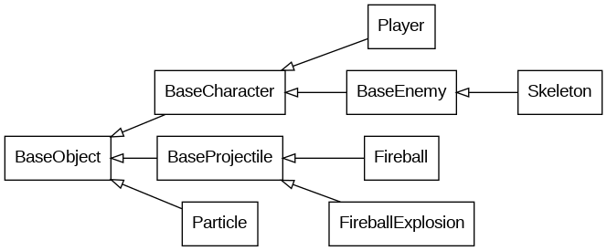

# 2dgame

~~Small and simple~~ 2D game that uses SDL2 for rendering. Mainly working on this for fun while I have plenty of spare time :).

## Task List
[todo.txt](todo.txt)

## Inheritance Diagram

Inheritance diagram generated from [inheritance.gv](inheritance.gv) using Graphviz.



The .png can be generated by using
```
dot -Tpng -O inheritance.gv
```

## Building

Oh, if you want to build it (requires SDL2 and cmake): 

1. Create a build directory
    ```shell
    mkdir build
    ```

2. Create the build files
    ```shell
    cmake -S . -B build
    ```

3. Build the program
    ```shell
    make -C build
    ```

4. Run the program :)
    ```shell
    build/2dgame
    ```

### For fun

Counting all the lines of code `find src/ include/ -regex '.*/.*\.\(cpp\|h\)$' | xargs wc -l`.

## Considerations for Future Projects

- Try using an ECS architecture
- Look into embedded lua for scripting
